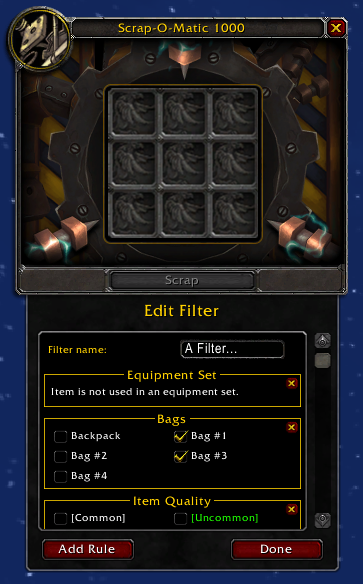

# EasyScrap
Fork of [EasyScrap](https://www.curseforge.com/wow/addons/easy-scrap)

### <ins>Some of the things noted below do not work anymore.</ins>

## Original description
Easy Scrap adds a new frame to the Scrap interface that shows you all items in your bags available for scrapping and lets you queue items.

### Features:
* See all items you can scrap without having to look in your bags and search for even faster results.
* Queue up items and have them automatically placed into the scrapper when the scrapper is empty again.
* Create a keybinding for the scrap button. Look under Key Bindings->Addons->Easy Scrap
* Hide specific items you do not want to see in the "Eligible" tab by right clicking them.
* With the default filter automatically hides all gear that is used in an equipment set.
Create custom filters to automatically ignore items. Leave a comment if you have a specific filter request.
 

If you want to macro the scrap button create a macro with the following text:

`/click EasyScrap_ScrapKeybindFrame LeftButton 1`

 

Please report any weird behavior if you see any and always make sure you're not scrapping an item you want to keep.

## Original Media

